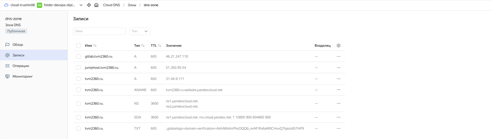
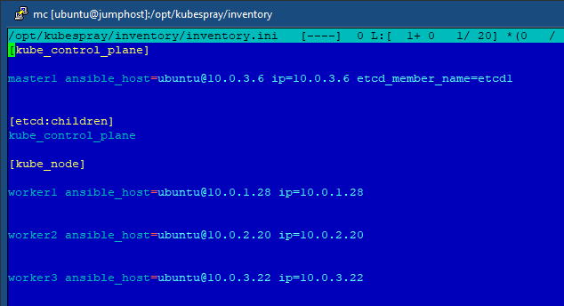

## Разворачивание основной инфраструктуры devops-diplom-yandexcloud
---
  * [Подготовка](#Подготовка)
  * [Развертывание](#Развертывание)
  * [Процессы](#Процессы)
  * [Требования](#Требования)
  * [Поставщики](#Поставщики)
  * [Модули](#Модули)
  * [Ресурсы](#Ресурсы)
  * [Переменные](#Переменные)
  * [Вывод](#Вывод)
---
### Подготовка
---
Перед разворачиванием основной инфраструктуры в [devops-diplom-yandexcloud-infrastructure](https://github.com/tvm2360/devops-diplom-yandexcloud-infrastructure) необходимо сгенерировать 2 пары ключей или использовать имеющиеся, к примеру:
```
ssh-keygen -t ed25519 -f ~/.ssh/id_yc_ed25519
ssh-keygen -t ed25519 -f ~/.ssh/id_yc_ed25519_1
```

Первая пара необходима для взаимодействия с Jumphost, вторая - для взаимодействия Jumphost с хостами в приватной зоне. Домен tvm2360.ru зарегистрирован, выпущен сертификат.

Далее необходимо подготовить CI/CD, установив соответствующие значения используемым в рабочих процессах переменным (secret) проекта:


- CI_BACKEND_CREDENTIALS_BASE64 и CI_SA_KEY_BASE64 - формируются содержимым файлов в [devops-diplom-yandexcloud-prepare](https://github.com/tvm2360/devops-diplom-yandexcloud-prepare) в формате base64
- YC_CLOUD_ID - ID облака
- YC_FOLDER_ID - ID каталога
- CERTIFICATE_ID - ID сертификата
- DNS_ZONE_ID - ID DNS зоны
- SSH_KEY_PRIV_BASE64 - формируются содержимым закрытой части 1-го ключа в формате base64 (к примеру содержимым ```cat ~/.ssh/id_yc_ed25519 | base64```)
- SSH_KEY_PUB_BASE64 - формируются содержимым открытой части 1-го ключа в формате base64 (к примеру содержимым ```cat ~/.ssh/id_yc_ed25519.pub | base64```)
- SSH_KEY_1_PRIV_BASE64 - формируются содержимым закрытой части 2-го ключа в формате base64 (к примеру содержимым ```cat ~/.ssh/id_yc_ed25519_1 | base64```)
- SSH_KEY_1_PUB_BASE64 - формируются содержимым открытой части 2-го ключа в формате base64  (к примеру содержимым ```cat ~/.ssh/id_yc_ed25519_1.pub | base64```)

Далее определяемся с характеристикам инстансов Jumphost и Gitlab (vm.auto.tfvars):
```
vm_config = {
  jumphost = {
     cpu = 2,
     ram = 2,
     core_fraction = 20,
     disk_type = "network-hdd",
     disk_volume = 30,
     platform_id = "standard-v3",
     preemptible = false,
     use_nat = true,
     ip_address = "10.0.4.254",
     stopping_for_update = true,
     serial_port_enable = 0
  },
  gitlab = {
     cpu = 2,
     ram = 8,
     core_fraction = 50,
     disk_type = "network-hdd",
     disk_volume = 20,
     platform_id = "standard-v3",
     preemptible = false,
     use_nat = true,
     ip_address = "",
     stopping_for_update = true,
     serial_port_enable = 0
  }
}
```
, и групп инстансов K8s (masters, workers), Gitlab (runners) - (ig.auto.tfvars):
```
ig_config = {
  masters = {
     count = 1,
     cpu = 2,
     ram = 2,
     core_fraction = 20,
     disk_type = "network-hdd",
     disk_volume = 10,
     platform_id = "standard-v3",
     preemptible = false,
     use_nat = false,
     serial_port_enable = 0
  },
  workers = {
     count = 3,
     cpu = 2,
     ram = 4,
     core_fraction = 20,
     disk_type = "network-hdd",
     disk_volume = 10,
     platform_id = "standard-v3",
     preemptible = true,
     use_nat = false,
     serial_port_enable = 0
  },
  gitlab_runners = {
     count = 1,
     cpu = 2,
     ram = 2,
     core_fraction = 20,
     disk_type = "network-hdd",
     disk_volume = 10,
     platform_id = "standard-v3",
     preemptible = true,
     use_nat = false,
     serial_port_enable = 0
  }
}
```
K8s кластер будем разворачивать на 4 инстансах (1-master, 3-workers) - этого достаточно для тестирования. В Gitlab будет использоваться 1 runner, что достаточно для небольшого проекта.

Развертывание будет происходить в зонах доступности ru-central1-a, ru-central1-b и ru-central1-d с использование 4 подсетей:
- 1-3-я - для организзации private network, где будут размещаться компоненты K8s, а также Gitlab workers. Доступ вовне через NAT инстанс
- 4-я - для организации public network, где будут размещаться Jumphost (NAT инстанс) и Gitlab

Остальные настройки оставляем по-умолчанию или меняем на свои.

### Развертывание

Jumphost - основной хост для развертывания проекта. Запуск сценариев развертывания K8s (kubespray), а также Gitlab-runners, в процессе развертывания
будут производиться из него. Будут установлено различное ПО: kubectl, k9s, ansible, helm и т.д, которое в дальнейшем может быть использоваться для проведния
различных тестов. Для организации томов хранения NFS в K8s устанавливается и настраивается сервер nfs-kernel-server.

Развертывание запускается процессами. Можно создать коммит и сформировать push и PR в master:


Автоматически запустяться процессы проверки синтаксиса и плана terraform. Проверяем результаты. Далее - Merge PR запустит процессы применения плана terraform:


Процесс идет порядка 20 минут. В результате:


произошло развертывание VM:


создание подсетей:


формирование Application Load Balancer:


формирование записей в DNS зоне:



выделение внешних IP:


State сформирован в S3 bucket:


Кластер сформирован:


На Jumphost в каталоге /opt находятся playbooks kubespray, который можно запускать для изменеия параметров кластера (например добавления worker ноды):




, а также преднастроеный playbooks Gitlab-Runners, в который нужно добавить только токены runner'ов. Количество конфигураций соответствует количеству runner'ов:


Развертывание завершено.

### Процессы

- Процесс "Plan Apply" запускается при выполнении операций "push" в ветку "master". При запуске происходит формирование базовой платформы запуска разворачивания, необходимого ПО,
 конфигураций, токена сервисного аккаунта, входящих переменных terraform из secret, инициализация и применение плана terraform.
- Процесс "Plan Test" запускается при открытии операции "pool_request" в ветку "master". При запуске происходит формирование базовой платформы запуска разворачивания, необходимого ПО,
 конфигураций, токена сервисного аккаунта, входящих переменных terraform из secret, инициализация и формирование плана terraform.
- Процесс "Plan Lint" запускается при открытии операции "push" или "pool_request" в любую ветку, кроме "master". При запуске происходит формирование базовой платформы и необходимого ПО,
 запуска проверки синтаксиса.


### Требования

| Name | Version |
|------|---------|
| <a name="requirement_terraform"></a> [terraform](#requirement\_terraform) | ~>1.8.4 |
| <a name="requirement_yandex"></a> [yandex](#requirement\_yandex) | >= 0.110.0 |

### Поставщики

| Name | Version |
|------|---------|
| <a name="provider_local"></a> [local](#provider\_local) | n/a |
| <a name="provider_null"></a> [null](#provider\_null) | n/a |
| <a name="provider_yandex"></a> [yandex](#provider\_yandex) | >= 0.110.0 |

### Модули

No modules.

### Ресурсы

| Name | Type |
|------|------|
| [local_file.gitlab_runners_ansible_playbook_script](https://registry.terraform.io/providers/hashicorp/local/latest/docs/resources/file) | resource |
| [local_file.gitlab_runners_inventory_cfg_script](https://registry.terraform.io/providers/hashicorp/local/latest/docs/resources/file) | resource |
| [local_file.kubespray_inventory_cfg](https://registry.terraform.io/providers/hashicorp/local/latest/docs/resources/file) | resource |
| [null_resource.gitlab_runners_ansible_playbook_script_file](https://registry.terraform.io/providers/hashicorp/null/latest/docs/resources/resource) | resource |
| [null_resource.gitlab_runners_inventory_cfg_script_file](https://registry.terraform.io/providers/hashicorp/null/latest/docs/resources/resource) | resource |
| [null_resource.kubespray_inventory_cfg_file](https://registry.terraform.io/providers/hashicorp/null/latest/docs/resources/resource) | resource |
| [null_resource.null_change_gitlab_settings](https://registry.terraform.io/providers/hashicorp/null/latest/docs/resources/resource) | resource |
| [null_resource.null_copy_ssh_gitlab_runners_ansible_inventory_config_script_to_jumphost](https://registry.terraform.io/providers/hashicorp/null/latest/docs/resources/resource) | resource |
| [null_resource.null_copy_ssh_gitlab_runners_ansible_playbook_script_to_jumphost](https://registry.terraform.io/providers/hashicorp/null/latest/docs/resources/resource) | resource |
| [null_resource.null_copy_ssh_gitlab_runners_ansible_playbook_to_jumphost](https://registry.terraform.io/providers/hashicorp/null/latest/docs/resources/resource) | resource |
| [null_resource.null_copy_ssh_kubespray_inventory_to_jumphost](https://registry.terraform.io/providers/hashicorp/null/latest/docs/resources/resource) | resource |
| [null_resource.null_copy_ssh_privatekey_to_jumphost](https://registry.terraform.io/providers/hashicorp/null/latest/docs/resources/resource) | resource |
| [null_resource.null_create_k8s_user](https://registry.terraform.io/providers/hashicorp/null/latest/docs/resources/resource) | resource |
| [null_resource.null_pull_kube_config](https://registry.terraform.io/providers/hashicorp/null/latest/docs/resources/resource) | resource |
| [null_resource.null_start_ansible_inventory_script](https://registry.terraform.io/providers/hashicorp/null/latest/docs/resources/resource) | resource |
| [null_resource.null_start_kubespray](https://registry.terraform.io/providers/hashicorp/null/latest/docs/resources/resource) | resource |
| [null_resource.null_wait_gitlab_runners_inventory_dir](https://registry.terraform.io/providers/hashicorp/null/latest/docs/resources/resource) | resource |
| [null_resource.null_wait_kubespray_inventory_dir](https://registry.terraform.io/providers/hashicorp/null/latest/docs/resources/resource) | resource |
| [yandex_alb_backend_group.alb-backend-group](https://registry.terraform.io/providers/yandex-cloud/yandex/latest/docs/resources/alb_backend_group) | resource |
| [yandex_alb_http_router.alb-router](https://registry.terraform.io/providers/yandex-cloud/yandex/latest/docs/resources/alb_http_router) | resource |
| [yandex_alb_load_balancer.alb](https://registry.terraform.io/providers/yandex-cloud/yandex/latest/docs/resources/alb_load_balancer) | resource |
| [yandex_alb_target_group.alb-target-group-1](https://registry.terraform.io/providers/yandex-cloud/yandex/latest/docs/resources/alb_target_group) | resource |
| [yandex_alb_target_group.alb-target-group-2](https://registry.terraform.io/providers/yandex-cloud/yandex/latest/docs/resources/alb_target_group) | resource |
| [yandex_alb_target_group.alb-target-group-3](https://registry.terraform.io/providers/yandex-cloud/yandex/latest/docs/resources/alb_target_group) | resource |
| [yandex_alb_virtual_host.alb-virtual-host](https://registry.terraform.io/providers/yandex-cloud/yandex/latest/docs/resources/alb_virtual_host) | resource |
| [yandex_compute_instance.vm_gitlab](https://registry.terraform.io/providers/yandex-cloud/yandex/latest/docs/resources/compute_instance) | resource |
| [yandex_compute_instance.vm_jumphost](https://registry.terraform.io/providers/yandex-cloud/yandex/latest/docs/resources/compute_instance) | resource |
| [yandex_compute_instance_group.ig-gitlab-runners](https://registry.terraform.io/providers/yandex-cloud/yandex/latest/docs/resources/compute_instance_group) | resource |
| [yandex_compute_instance_group.ig-k8s-masters](https://registry.terraform.io/providers/yandex-cloud/yandex/latest/docs/resources/compute_instance_group) | resource |
| [yandex_compute_instance_group.ig-k8s-workers](https://registry.terraform.io/providers/yandex-cloud/yandex/latest/docs/resources/compute_instance_group) | resource |
| [yandex_dns_recordset.tvm2360-recordset-in-domain](https://registry.terraform.io/providers/yandex-cloud/yandex/latest/docs/resources/dns_recordset) | resource |
| [yandex_dns_recordset.tvm2360-recordset-in-subdomain-1](https://registry.terraform.io/providers/yandex-cloud/yandex/latest/docs/resources/dns_recordset) | resource |
| [yandex_dns_recordset.tvm2360-recordset-in-subdomain-2](https://registry.terraform.io/providers/yandex-cloud/yandex/latest/docs/resources/dns_recordset) | resource |
| [yandex_iam_service_account.sa-admin](https://registry.terraform.io/providers/yandex-cloud/yandex/latest/docs/resources/iam_service_account) | resource |
| [yandex_resourcemanager_folder_iam_member.sa-admin-role-admin](https://registry.terraform.io/providers/yandex-cloud/yandex/latest/docs/resources/resourcemanager_folder_iam_member) | resource |
| [yandex_vpc_address.external-address](https://registry.terraform.io/providers/yandex-cloud/yandex/latest/docs/resources/vpc_address) | resource |
| [yandex_vpc_network.devops-diplom-network](https://registry.terraform.io/providers/yandex-cloud/yandex/latest/docs/resources/vpc_network) | resource |
| [yandex_vpc_route_table.vpc_route_table](https://registry.terraform.io/providers/yandex-cloud/yandex/latest/docs/resources/vpc_route_table) | resource |
| [yandex_vpc_security_group.sg-gitlab](https://registry.terraform.io/providers/yandex-cloud/yandex/latest/docs/resources/vpc_security_group) | resource |
| [yandex_vpc_security_group.sg-gitlab-runners](https://registry.terraform.io/providers/yandex-cloud/yandex/latest/docs/resources/vpc_security_group) | resource |
| [yandex_vpc_security_group.sg-k8s](https://registry.terraform.io/providers/yandex-cloud/yandex/latest/docs/resources/vpc_security_group) | resource |
| [yandex_vpc_subnet.devops-diplom-subnet-1](https://registry.terraform.io/providers/yandex-cloud/yandex/latest/docs/resources/vpc_subnet) | resource |
| [yandex_vpc_subnet.devops-diplom-subnet-2](https://registry.terraform.io/providers/yandex-cloud/yandex/latest/docs/resources/vpc_subnet) | resource |
| [yandex_vpc_subnet.devops-diplom-subnet-3](https://registry.terraform.io/providers/yandex-cloud/yandex/latest/docs/resources/vpc_subnet) | resource |
| [yandex_vpc_subnet.devops-diplom-subnet-4](https://registry.terraform.io/providers/yandex-cloud/yandex/latest/docs/resources/vpc_subnet) | resource |
| [yandex_cm_certificate.tvm2360-cm-certificate](https://registry.terraform.io/providers/yandex-cloud/yandex/latest/docs/data-sources/cm_certificate) | data source |

### Переменные

| Name | Description | Type | Default | Required |
|------|-------------|------|---------|:--------:|
| <a name="input_alb_backend_healthcheck_interval"></a> [alb\_backend\_healthcheck\_interval](#input\_alb\_backend\_healthcheck\_interval) | Backend health check test interval | `string` | `"1s"` | no |
| <a name="input_alb_backend_healthcheck_port"></a> [alb\_backend\_healthcheck\_port](#input\_alb\_backend\_healthcheck\_port) | Backend health check TCP port | `number` | `80` | no |
| <a name="input_alb_backend_healthcheck_timeout"></a> [alb\_backend\_healthcheck\_timeout](#input\_alb\_backend\_healthcheck\_timeout) | Backend health check test timeout | `string` | `"1s"` | no |
| <a name="input_alb_backend_panic_threshold"></a> [alb\_backend\_panic\_threshold](#input\_alb\_backend\_panic\_threshold) | Backend panic threshold | `number` | `50` | no |
| <a name="input_alb_backend_weight"></a> [alb\_backend\_weight](#input\_alb\_backend\_weight) | Backend weight | `number` | `1` | no |
| <a name="input_certificate_id"></a> [certificate\_id](#input\_certificate\_id) | https://yandex.cloud/ru/docs/certificate-manager/operations/managed/cert-create | `string` | n/a | yes |
| <a name="input_certificate_wait_validation"></a> [certificate\_wait\_validation](#input\_certificate\_wait\_validation) | Wait certificate lets encrypt validation | `bool` | `true` | no |
| <a name="input_cidr_1"></a> [cidr\_1](#input\_cidr\_1) | https://cloud.yandex.ru/docs/vpc/operations/subnet-create | `list(string)` | <pre>[<br/>  "10.0.1.0/24"<br/>]</pre> | no |
| <a name="input_cidr_2"></a> [cidr\_2](#input\_cidr\_2) | https://cloud.yandex.ru/docs/vpc/operations/subnet-create | `list(string)` | <pre>[<br/>  "10.0.2.0/24"<br/>]</pre> | no |
| <a name="input_cidr_3"></a> [cidr\_3](#input\_cidr\_3) | https://cloud.yandex.ru/docs/vpc/operations/subnet-create | `list(string)` | <pre>[<br/>  "10.0.3.0/24"<br/>]</pre> | no |
| <a name="input_cidr_4"></a> [cidr\_4](#input\_cidr\_4) | https://cloud.yandex.ru/docs/vpc/operations/subnet-create | `list(string)` | <pre>[<br/>  "10.0.4.0/24"<br/>]</pre> | no |
| <a name="input_cloud_id"></a> [cloud\_id](#input\_cloud\_id) | https://cloud.yandex.ru/docs/resource-manager/operations/cloud/get-id | `string` | n/a | yes |
| <a name="input_default_user"></a> [default\_user](#input\_default\_user) | Default user via ssh | `string` | `"ubuntu"` | no |
| <a name="input_default_zone"></a> [default\_zone](#input\_default\_zone) | https://cloud.yandex.ru/docs/overview/concepts/geo-scope | `string` | `"ru-central1-a"` | no |
| <a name="input_dns_zone_id"></a> [dns\_zone\_id](#input\_dns\_zone\_id) | https://yandex.cloud/ru/docs/dns/concepts/dns-zone | `string` | n/a | yes |
| <a name="input_domain_name"></a> [domain\_name](#input\_domain\_name) | Domain name | `string` | `"tvm2360.ru"` | no |
| <a name="input_folder_id"></a> [folder\_id](#input\_folder\_id) | https://cloud.yandex.ru/docs/resource-manager/operations/folder/get-id | `string` | n/a | yes |
| <a name="input_get_helm_script_download_link"></a> [get\_helm\_script\_download\_link](#input\_get\_helm\_script\_download\_link) | K9s link for download | `string` | `"https://raw.githubusercontent.com/helm/helm/main/scripts/get-helm-3"` | no |
| <a name="input_gitlab_change_gitlab_settings_timeout"></a> [gitlab\_change\_gitlab\_settings\_timeout](#input\_gitlab\_change\_gitlab\_settings\_timeout) | Timeout in seconds before start gitlab settings changing | `number` | `180` | no |
| <a name="input_gitlab_runners_ansible_playbook_script_file"></a> [gitlab\_runners\_ansible\_playbook\_script\_file](#input\_gitlab\_runners\_ansible\_playbook\_script\_file) | Path to export ansible playbook script file for running on gitlab runners platforms | `string` | `"../gitlab-runners/start_reg_runners.sh"` | no |
| <a name="input_gitlab_runners_connect_use_nat_ip"></a> [gitlab\_runners\_connect\_use\_nat\_ip](#input\_gitlab\_runners\_connect\_use\_nat\_ip) | Use gtitlab nat\_ip for runners connecting | `bool` | `false` | no |
| <a name="input_gitlab_runners_inventory_cfg_script_file"></a> [gitlab\_runners\_inventory\_cfg\_script\_file](#input\_gitlab\_runners\_inventory\_cfg\_script\_file) | Path to export ansible playbook inventory config script file for running on gitlab runners platforms | `string` | `"../gitlab-runners/generate_inventory.sh"` | no |
| <a name="input_gitlab_runners_playbook_file"></a> [gitlab\_runners\_playbook\_file](#input\_gitlab\_runners\_playbook\_file) | Path to export ansible playbook file for connecting gitlab runners use | `string` | `"../gitlab-runners/playbooks/site.yml"` | no |
| <a name="input_gitlab_subdomain_name"></a> [gitlab\_subdomain\_name](#input\_gitlab\_subdomain\_name) | Gitlab subdomain name | `string` | `"gitlab"` | no |
| <a name="input_ig_config"></a> [ig\_config](#input\_ig\_config) | Instance group config | <pre>map(object({<br/>    count               = number,<br/>    cpu                 = number,<br/>    ram                 = number,<br/>    core_fraction       = number,<br/>    disk_type           = string,<br/>    disk_volume         = number,<br/>    platform_id         = string,<br/>    preemptible         = bool,<br/>    use_nat             = bool,<br/>    serial_port_enable  = number<br/>  }))</pre> | `{}` | no |
| <a name="input_jumphost_subdomain_name"></a> [jumphost\_subdomain\_name](#input\_jumphost\_subdomain\_name) | Jumphost subdomain name | `string` | `"jumphost"` | no |
| <a name="input_k8s_default_group"></a> [k8s\_default\_group](#input\_k8s\_default\_group) | Kubernetes group for created user | `string` | `"system:masters"` | no |
| <a name="input_k8s_user_context"></a> [k8s\_user\_context](#input\_k8s\_user\_context) | Kubernetes user context | `string` | `"k8suser-context"` | no |
| <a name="input_k8s_username"></a> [k8s\_username](#input\_k8s\_username) | Kubernetes username for create | `string` | `"k8suser"` | no |
| <a name="input_k9s_download_link"></a> [k9s\_download\_link](#input\_k9s\_download\_link) | K9s link for download | `string` | `"https://github.com/derailed/k9s/releases/download/v0.32.5/k9s_linux_amd64.deb"` | no |
| <a name="input_kubectl_download_link"></a> [kubectl\_download\_link](#input\_kubectl\_download\_link) | Kubespray link for download | `string` | `"https://dl.k8s.io/release/v1.31.4/bin/linux/amd64/kubectl"` | no |
| <a name="input_kubespray_docker_image"></a> [kubespray\_docker\_image](#input\_kubespray\_docker\_image) | Docker image path for kubespray | `string` | `"quay.io/kubespray/kubespray:v2.27.0"` | no |
| <a name="input_kubespray_inventory_destination_path"></a> [kubespray\_inventory\_destination\_path](#input\_kubespray\_inventory\_destination\_path) | Path to export inventory for kubespray use | `string` | `"../kubespray/inventory"` | no |
| <a name="input_kubespray_inventory_filename"></a> [kubespray\_inventory\_filename](#input\_kubespray\_inventory\_filename) | Inventory filename for kubespray use | `string` | `"inventory.ini"` | no |
| <a name="input_kubespray_inventory_nat_ip"></a> [kubespray\_inventory\_nat\_ip](#input\_kubespray\_inventory\_nat\_ip) | Use nat\_ip in inventory file | `bool` | `false` | no |
| <a name="input_os_image_1_id"></a> [os\_image\_1\_id](#input\_os\_image\_1\_id) | Image OS ubuntu-2004-lts | `string` | `"fd8a364q1kb08cqvr9o7"` | no |
| <a name="input_os_image_2_id"></a> [os\_image\_2\_id](#input\_os\_image\_2\_id) | Image OS gitlab | `string` | `"fd8duj8tk09diqs6t2rq"` | no |
| <a name="input_os_image_3_id"></a> [os\_image\_3\_id](#input\_os\_image\_3\_id) | Image OS nat-instance-ubuntu-2204 | `string` | `"fd816m4fbp8be1hkdopi"` | no |
| <a name="input_subnet_name_1"></a> [subnet\_name\_1](#input\_subnet\_name\_1) | Subnet 1 name | `string` | `"devops-diplom-subnet-1"` | no |
| <a name="input_subnet_name_2"></a> [subnet\_name\_2](#input\_subnet\_name\_2) | Subnet 2 name | `string` | `"devops-diplom-subnet-2"` | no |
| <a name="input_subnet_name_3"></a> [subnet\_name\_3](#input\_subnet\_name\_3) | Subnet 3 name | `string` | `"devops-diplom-subnet-3"` | no |
| <a name="input_subnet_name_4"></a> [subnet\_name\_4](#input\_subnet\_name\_4) | Subnet 4 name | `string` | `"devops-diplom-subnet-4"` | no |
| <a name="input_token"></a> [token](#input\_token) | https://cloud.yandex.ru/docs/resource-manager/operations/cloud/get-id | `string` | n/a | yes |
| <a name="input_vm_config"></a> [vm\_config](#input\_vm\_config) | Virtual machines config | <pre>map(object({<br/>    cpu                 = number,<br/>    ram                 = number,<br/>    core_fraction       = number,<br/>    disk_type           = string,<br/>    disk_volume         = number,<br/>    platform_id         = string,<br/>    preemptible         = bool,<br/>    use_nat             = bool,<br/>    ip_address          = string,<br/>    stopping_for_update = bool,<br/>    serial_port_enable  = number<br/>  }))</pre> | `{}` | no |
| <a name="input_vpc_name"></a> [vpc\_name](#input\_vpc\_name) | VPC name | `string` | `"devops-diplom-network"` | no |
| <a name="input_zone_1"></a> [zone\_1](#input\_zone\_1) | https://cloud.yandex.ru/docs/overview/concepts/geo-scope | `string` | `"ru-central1-a"` | no |
| <a name="input_zone_2"></a> [zone\_2](#input\_zone\_2) | https://cloud.yandex.ru/docs/overview/concepts/geo-scope | `string` | `"ru-central1-b"` | no |
| <a name="input_zone_3"></a> [zone\_3](#input\_zone\_3) | https://cloud.yandex.ru/docs/overview/concepts/geo-scope | `string` | `"ru-central1-d"` | no |

### Вывод

No outputs.
